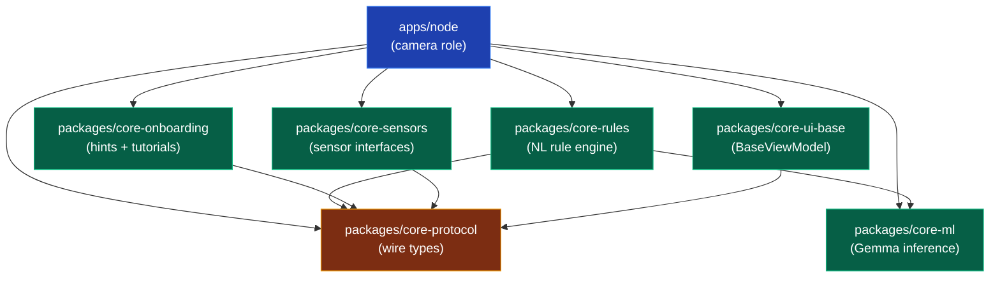
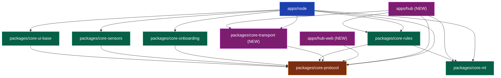

# Atalaya — Module Map

The dependency graph between Atalaya's apps and packages. GitHub renders Mermaid natively — view this file on github.com to see the visuals.

## Phase 1 dependency graph



**Read top-down.** `apps/node` depends on every package. The packages depend only on `core-protocol` (the leaf), and `core-rules` additionally depends on `core-ml` because rule evaluation calls into the LLM judge.

## Phase 2 expansion (preview)



Phase 2 introduces `apps/hub`, `apps/hub-web`, and a new `packages/core-transport` for FCM / ntfy / DispatchTransport implementations of the `AlertTransport` interface.

## Folder layout (current state on disk)

```
atalaya/
├── apps/
│   ├── README.md
│   └── node/                         ← Phase 1 — camera role
│       ├── README.md
│       └── src/main/kotlin/         (skeleton — code lands in roadmap Step 3+)
│
├── packages/
│   ├── README.md
│   ├── core-protocol/               ← wire types (the leaf)
│   │   ├── README.md
│   │   └── src/main/kotlin/
│   ├── core-onboarding/             ← hints + tutorials
│   │   ├── README.md
│   │   └── src/main/kotlin/
│   ├── core-rules/                  ← NL rule engine
│   │   ├── README.md
│   │   └── src/main/kotlin/
│   ├── core-ml/                     ← Gemma inference
│   │   ├── README.md
│   │   └── src/main/kotlin/
│   ├── core-sensors/                ← sensor interfaces
│   │   ├── README.md
│   │   └── src/main/kotlin/
│   └── core-ui-base/                ← BaseViewModel from Bitwarden
│       ├── README.md
│       └── src/main/kotlin/
│
├── infra/
│   └── README.md                    ← (Phase 2+ — hub deployment)
│
└── docs/
    ├── README.md
    ├── ARCHITECTURE.md
    ├── MODULE-MAP.md                ← (this file)
    ├── PRD-PHASES.md
    ├── framework/
    │   └── PHASE-TEMPLATE/
    └── phase-1/
        ├── README.md
        ├── 01-goal.md
        ├── 02-roadmap.md
        ├── decisions/
        ├── modules/
        ├── references/
        └── research/
```

## Dependency rules (per ADR-0001)

1. Apps depend on packages.
2. Packages may depend on other packages — but the graph stays acyclic.
3. Packages NEVER depend on apps.
4. Apps NEVER depend on each other directly. Cross-app comms go through `core-protocol`.
5. `core-protocol` is the leaf. It depends on nothing internal.

## How to read the Mermaid graphs

- **Blue boxes** = apps (deliverables).
- **Green boxes** = packages (shared modules).
- **Orange box** = `core-protocol`, the leaf.
- **Purple boxes** = items added in Phase 2 (preview only).
- Arrows point from dependent to dependency. `A → B` means "A depends on B."

## Adding a new module

1. Decide: app or package? Apps are deliverables (have a UI or run as a server). Packages are shared logic with no user-facing surface.
2. If app: create `apps/<name>/` with README + `src/`.
3. If package: create `packages/<name>/` with README + `src/`.
4. Add the row to [`apps/README.md`](../apps/README.md) or [`packages/README.md`](../packages/README.md).
5. Update this `MODULE-MAP.md` graph.
6. Open an ADR in the relevant phase if the new module changes the dependency rules.
